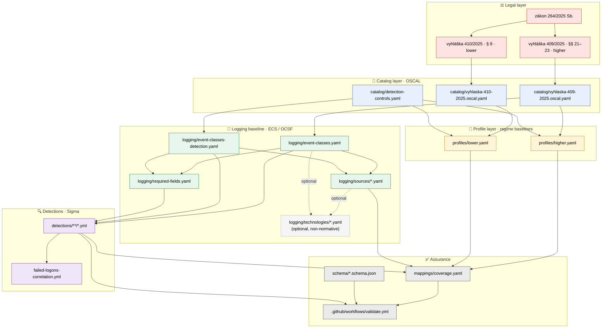
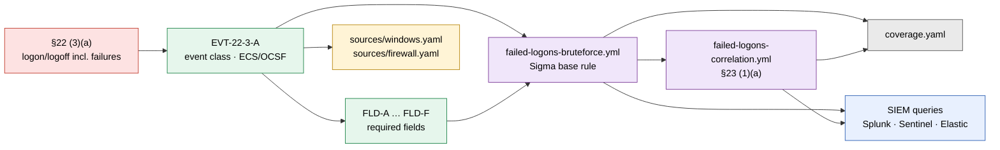
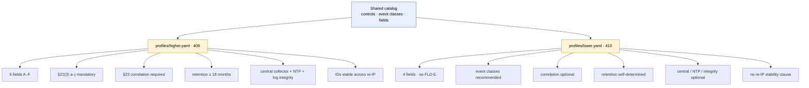

# Architecture & dependency graph

This document visualizes how the artifacts in this repository depend on each
other, from the authoritative legal text down to vendor SIEM queries.

> **Rendering note.** The diagrams below use [Mermaid](https://mermaid.js.org/),
> which **GitHub renders natively** in Markdown. In **VS Code**, the built-in
> preview does *not* support Mermaid — install the extension
> **"Markdown Preview Mermaid Support"** (`bierner.markdown-mermaid`) and reopen
> the preview (`Ctrl/Cmd+Shift+V`). A plain-text (ASCII) fallback is included
> under each diagram for environments without Mermaid.

---

## 1. The 4-layer model (full dependency graph)



<details>
<summary>ASCII fallback</summary>

```text
⚖️  LEGAL
    zákon 264/2025 Sb.
    ├─► vyhláška 409/2025  (§§ 21–23 · higher regime)
    └���► vyhláška 410/2025  (§ 9 · lower regime)

📜  CATALOG (OSCAL)                      derived from the decrees
    409 ─► catalog/vyhlaska-409-2025.oscal.yaml
    410 ─► catalog/vyhlaska-410-2025.oscal.yaml
           catalog/detection-controls.yaml      (shared CTL-*)

🎯  PROFILES (regime baselines)
    cat-409 + detection-controls ─► profiles/higher.yaml
    cat-410 + detection-controls ─► profiles/lower.yaml

🧱  LOGGING BASELINE (ECS / OCSF)
    cat-409             ─► logging/event-classes.yaml            (§22(3) a–j)
    detection-controls  ─► logging/event-classes-detection.yaml  (§9(1) a–c)
    event-classes (×2)  ─► logging/required-fields.yaml          (FLD-A…F)
    event-classes (×2)  ─► logging/sources/*.yaml                (win/linux/fw)
    sources + classes   ┄► logging/technologies/*.yaml           (optional, non-normative)

🔍  DETECTIONS (Sigma)
    event-classes + required-fields ─► detections/**/*.yml
    base rule                       ─► detections/auth/failed-logons-correlation.yml (§23)

✅  ASSURANCE
    profiles + sources + detections          ─► mappings/coverage.yaml
    coverage + schema/*.json + detections    ─► .github/workflows/validate.yml  ✔ / ✘
```

</details>

---

## 2. End-to-end trace of one obligation (§22(3)(a) → SIEM)

This shows a single legal requirement flowing all the way to vendor queries —
the view an auditor cares about.



<details>
<summary>ASCII fallback</summary>

```text
 §22(3)(a)            EVT-22-3-A           required-fields         Sigma base rule
 logon/logoff   ──►   event class    ──►   FLD-A … FLD-F    ──►    failed-logons-
 incl. failures       (ECS/OCSF)           (mandatory)             bruteforce.yml
                           │                                            │
                           ▼                                            ▼
                      sources/                                     correlation rule
                      windows.yaml                                 failed-logons-
                      firewall.yaml                                correlation.yml (§23)
                                                                        │
                          mappings/coverage.yaml  ◄────────────────────┤
                                                                        ▼
                          SIEM queries:  Splunk · Sentinel · Elastic · QRadar
```

</details>

---

## 3. Regime tailoring (one catalog → two baselines)



<details>
<summary>ASCII fallback</summary>

```text
                    Shared catalog
            (controls · event classes · fields)
                     │                │
          ┌──────────┘                └──────────┐
          ▼                                      ▼
    profiles/higher.yaml                   profiles/lower.yaml
    (409 · higher regime)                  (410 · lower regime)
          │                                      │
          ├─ 6 fields  A–F                       ├─ 4 fields  (no FLD-E)
          ├─ §22(3) a–j  MANDATORY               ├─ event classes  recommended
          ├─ §23 correlation  REQUIRED           ├─ correlation  optional
          ├─ retention ≥ 18 months               ├─ retention  self-determined
          ├─ central + NTP + log integrity       ├─ those controls  optional
          └─ IDs stable across re-IP             └─ no re-IP stability clause
```

</details>

---

## Legend

| Color | Layer |
|---|---|
| 🔴 red | Legal text (authoritative decrees) |
| 🔵 blue | OSCAL catalogs / shared controls |
| 🟡 yellow | Regime profiles |
| 🟢 green | Logging baseline (event classes, fields, sources) |
| 🟣 purple | Sigma detection rules |
| ⚪ grey | Coverage / schema / CI assurance |
